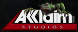
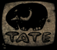

# Reversed Format Collection

This repository is filled with various notes on various different formats that I've reversed overtime. A lot of these
are provided in
[Rehex](https://github.com/solemnwarning/rehex)'s
[Binary Template](https://solemnwarning.net/rehex/manual/bt.html) format,
which is easily translatable into C/C++ and most other languages.

As noted in the [license](./LICENSE), I'm releasing all of this documentation into the public domain.
That said, a reference or callout wouldn't hurt! ❤️

Contributions are also welcome!
Just keep in mind that the plan is to keep *everything* here public domain.

----

## [Acclaim Studios Austin](https://en.wikipedia.org/wiki/Acclaim_Studios_Austin)

Also known as Iguana Entertainment.

### Turok Evolution Engine (2003 - )

Not entirely sure if this engine has another name or not,
but it appears to have been developed during Vexx's and Turok Evolution's development,
with the latter being the first game released utilising it.

Supported the Nintendo GameCube, Sony PlayStation 2, Microsoft Xbox and Microsoft Windows.

- [Turok: Evolution](https://en.wikipedia.org/wiki/Turok:_Evolution) (2002)
- [Vexx](https://en.wikipedia.org/wiki/Vexx) (2003)
- [The Red Star](https://hiddenpalace.org/Category:The_Red_Star_prototypes) (Cancelled)
- [100 Bullets](https://hiddenpalace.org/Category:100_Bullets_prototypes) (Cancelled)

| Name | Description        | Status   | URL                              |
|------|--------------------|----------|----------------------------------|
| TRE  | Package format     | **100%** | [Link](asaustin/asaustin_tre.bt) |
| EMI  | Emitter definition | **80%**  | [Link](asaustin/asaustin_emi.md) |

## [Acclaim Studios Teesside](https://en.wikipedia.org/wiki/List_of_Acclaim_Entertainment_subsidiaries#Acclaim_Studios_Teesside)

### Vista 3D

The below covers both the earlier '97 iteration of the engine and onwards.

| Name | Description                                  | Status   | URL                                                                                                                                                                                                                                     |
|------|----------------------------------------------|----------|-----------------------------------------------------------------------------------------------------------------------------------------------------------------------------------------------------------------------------------------|
| 3DF  | 3dfx texture format (used for 3dfx renderer) | **100%** | [Link](https://groups.google.com/g/comp.graphics.api.opengl/c/DOyoes__iVQ/m/1xrKlM7nnNwJ) ([reference implementation](https://github.com/OldTimes-Software/hei/blob/244efe8214bacf0a4ac6f6d258d7850edea89e06/plcore/image/image_3df.c)) |
| BSP  |                                              | Pending  |                                                                                                                                                                                                                                         |
| BGM  | Background model (?)                         | Pending  |                                                                                                                                                                                                                                         |
| BIN  | Texture data (used for software renderer)    | Pending  |                                                                                                                                                                                                                                         |
| SOB  | Static objects (?)                           | Pending  |                                                                                                                                                                                                                                         |
| MSH  | Mesh data                                    | Pending  |                                                                                                                                                                                                                                         |
| WEI  | Mesh weight data                             | Pending  |                                                                                                                                                                                                                                         |
| TUV  | Mesh UV data (?)                             | Pending  |                                                                                                                                                                                                                                         |
| ANM  | Mesh animation                               | Pending  |                                                                                                                                                                                                                                         |

## [Appeal S.A.](https://www.mobygames.com/company/appeal-studios-sa)

Developers behind [Outcast](https://www.mobygames.com/game/windows/outcast).

| Name | Description | Status  | Games   | URL                          |
|------|-------------|---------|---------|------------------------------|
| MSH  | Mesh format | **80%** | Outcast | [Link](appeal/appeal_msh.bt) |

## [Blitz Games Ltd](https://www.mobygames.com/company/blitz-games-ltd_)

UK-based developer that shut down in 2013.
Developed a number of different games, some of which do seem to share common technology.

### B1 (1998 - 2002)

This is the term we'll use to refer to Blitz's technology used in earlier games from the PlayStation, Nintendo 64 and
Saturn era, starting with Glover.

- Glover (1998)
- Action Man: Operation Extreme (1999)
- Action Man: Destruction X (2000)
- Frogger 2: Swampy's Revenge (2000)
- Titan A.E. (Demo, 2000) (Cancelled)
- Chicken Run (2000)
- Cubix: Robots For Everyone - Race 'N Robots (?) (2001)
- Disney's Lilo & Stitch: Trouble in Paradise (2002)

| Name | Description    | Status                                                                                              | URL                        |
|------|----------------|-----------------------------------------------------------------------------------------------------|----------------------------|
| DAT  | Package format | **Done** ([hashing](https://github.com/OldTimes-Software/hei/blob/master/extras/blitz/blitz.c#L15)) | [Link](blitz/blitz_dat.bt) |
| PSI  | Model format   | Partial                                                                                             | [Link](blitz/blitz_psi.bt) |

## [Creative Reality](https://www.mobygames.com/company/creative-reality)

### Martian Gothic Engine (PC)

Unfortunately only used for one game, which, you guessed it,
was [Martian Gothic: Unification](https://www.mobygames.com/game/martian-gothic-unification).

#### Fun Facts
- Excluding the `QMDX.dll`, which isn't theirs, the oldest file in the PC version is from August 1998.
- According to MobyGames, this was the last title Creative Reality would produce.
- They appear to have made a mistake with the application icon; the largest size has the smaller icon overlaid on top.
- PlayStation port was handled by Coyote Developments Ltd., which [went into administration in 2006](https://find-and-update.company-information.service.gov.uk/company/03657440/filing-history?page=2).
- Some of the textures are appended with 'tiff' which may suggest they used it as an intermediate format before conversion.

#### Formats

| Name    | Description                            | Status   | URL                                     |
|---------|----------------------------------------|----------|-----------------------------------------|
| GFX/TEX | Texture package                        | **100%** | [Link](creality/creality_format_tex.bt) |
| ATH     | Container table format                 | **50%**  | [Link](creality/creality_format_ath.bt) |
| ATF     | Container format                       | Pending  |                                         |
| ANM     | Mesh (and animation?) data             | Pending  |                                         |
| CAM     | Background / camera data               | Pending  | [Link](creality/creality_format_cam.bt) |
| ROOM    | Room data                              | Pending  |                                         |
| GRP     | Some sort of ANM related table thingy? | Pending  |                                         |

## [Core Design](https://en.wikipedia.org/wiki/Core_Design)

### Tomb Raider Engine (1996 - 2000)

### Herdy Gerdy Engine (2002)

Unaware of any proper name for this particular engine.
There is some cross-over between this and the engine developed for the cancelled Tomb Raider Anniversary.

#### Games

- [Herdy Gerdy (2002)](https://www.mobygames.com/game/herdy-gerdy)

#### Formats

| Name | Description                             | Status                      | URL                      |
|------|-----------------------------------------|-----------------------------|--------------------------|
| CLU  | Package format                          | **100%**                    | [Link](core/core_clu.bt) |
| HGT  | Texture format ('Herdy Gerdy Texture'?) | **50%** (container for BMP) | [Link](core/core_hgt.bt) |
| HGM  | Model format ('Herdy Gerdy Model'?)     | Pending                     | N/A                      |
| GLV  | Level format ('Gerdy Level'?)           | Pending                     | N/A                      |

## [Computer Artworks Ltd.](https://www.mobygames.com/company/computer-artworks-ltd)

Developed two games, [Evolva](https://www.mobygames.com/game/windows/evolva)
and [The Thing](https://www.mobygames.com/game/thing).
Both games appear to be derived from the same in-house technology.

| Name | Description                  | Status                        | Games             | URL                                 |
|------|------------------------------|-------------------------------|-------------------|-------------------------------------|
| 3DF  | Bitmap font descriptor       | **70%**                       | The Thing         | [Link](computer-artworks/ca_3df.bt) |
| AN   | Animation data               | Pending                       | The Thing         | N/A                                 |
| BIN  | Entity data                  | Partial                       | The Thing         | [Link](computer-artworks/ca_bin.bt) |
| BT   | Strings                      | **80%**                       | The Thing         | [Link](computer-artworks/ca_bt.bt)  |
| ENT  | Text-based entity descriptor | Pending                       | Evolva            | N/A                                 |
| GEO  | Collision mesh data          | Pending                       | The Thing         | N/A                                 | 
| FX   | Text-based effect descriptor | Pending                       | The Thing         | N/A                                 |
| LVL  | INI level descriptor format  | Pending                       | Evolva, The Thing | N/A                                 |
| MSH  | Mesh data                    | Partial                       | Evolva, The Thing | [Link](computer-artworks/ca_msh.bt) |
| PAK  | ZIP package                  | **100%** (it's a zip :shrug:) | The Thing         | N/A                                 |
| SGH  | 'SceneGraph'                 | Pending                       | Evolva, The Thing | N/A                                 |

## [Gee Whiz! Entertainment](https://www.mobygames.com/company/gee-whiz-entertainment)

| Name | Description    | Status   | Games       | URL                    |
|------|----------------|----------|-------------|------------------------|
| H95  |                | Partial  | Zombie Wars | [Link](geewhiz/h95.md) |
| SB0  | Package format | **100%** | Zombie Wars | [Link](geewhiz/sb0.md) |
| SPR  | Sprite format  | Partial  | Zombie Wars | [Link](geewhiz/spr.md) |

## [Guerrilla Cambridge](https://www.mobygames.com/company/guerrilla-cambridge)

Also known as Millennium Interactive Ltd. and SCE Studio Cambridge.

| Name | Description                       | Status | Games                  | URL                         |
|------|-----------------------------------|--------|------------------------|-----------------------------|
| MWD  | Package format, 'Millennium WAD'? | ...    | C-12: Final Resistance | [Link](millennium/m_mwd.bt) |

## [Infogrames Studios Limited](https://www.mobygames.com/company/infogrames-studios-limited)

Also known as Gremlin Interactive Limited.
Developed games such as Hogs of War, Actua Soccer, Realms of the Haunting and many more.

Didn't really have an engine, but some of their games share some technology.

| Name | Description | Status  | Games             | URL                            |
|------|-------------|---------|-------------------|--------------------------------|
| MIN  | Model data  | Partial | Hogs of War (PSX) | [Link](gremlin/gremlin_min.bt) |

## [Midway Studios Austin](https://en.wikipedia.org/wiki/Midway_Studios_Austin)

Also known as Inevitable Entertainment, Inc..

### Unknown Engine

Games using this technology range from the following.

- Tribes: Aerial Assault (2002) (*need to confirm*)
- Defender (*need to confirm*)
- The Hobbit (2003)
- Area 51 (2005)

| Name    | Description                                  | Status                                   | URL                               |
|---------|----------------------------------------------|------------------------------------------|-----------------------------------|
| DFS     | TOC for packed data                          | Partial (**70%** for v1, **60%** for v3) | [Link](msaustin/msaustin_dfs.bt)  |
| .000    | Packed data                                  | **100%** (see *DFS*)                     | [Link](msaustin/msaustin_dfs.bt)  |
| XBMP    | Bitmap data                                  | ...                                      | [Link](msaustin/msaustin_xbmp.bt) |
| MATX    | Plaintext model data (unused? intermediate?) | Pending                                  | ...                               |
| NPCGEOM | NPC geometry data                            | Pending                                  | ...                               |
| RGEOM   | 'Regular'(?) geometry data                   | Pending                                  | ...                               |
| FXO     | Effect data                                  | Pending                                  | ...                               |

## [nStigate Games]()

Also known as Nihilistic Software.

### NOD Engine (2000 - ?)

Used for the following games.

- Vampire: The Masquerade –
  Redemption ([source](https://en.wikipedia.org/wiki/Vampire:_The_Masquerade_%E2%80%93_Redemption#Technology))
- StarCraft: Ghost (Cancelled)

| Name | Description                        | Status  | URL                         |
|------|------------------------------------|---------|-----------------------------|
| NAD  | Animation format                   | Pending | ...                         |
| NCE  | ...                                | Pending | ...                         |
| NCS  | ...                                | Pending | ...                         |
| NOC  | ...                                | Pending | ...                         |
| NOD  | Model format, 'Object Description' | Partial | [Link](nihilistic/n_nod.bt) |
| NNB  | ...                                | Pending | ...                         |
| NMB  | ...                                | Pending | ...                         |
| NMS  | ...                                | Pending | ...                         |
| NRT  | ...                                | Pending | ...                         |
| NUT  | ...                                | Pending | ...                         |

## [Tate Interactive](https://en.wikipedia.org/wiki/Tate_Multimedia)

Polish company primarily known for producing [Kao the Kangaroo](https://en.wikipedia.org/wiki/Kao_the_Kangaroo_(2000_video_game)).
Seems that the engine they developed ended up getting used for a number of different games and ported to a number of
different platforms.

### Denis Engine

Listing this separately for now as it seems quite different to the tech used in their later titles.
Name was picked based on the code path indicated by strings in Penguin Kelvin, specifically, `C:\coders\denis\denis\`.

#### Games

Only confirmed titles are here.
Confirmation is performed by finding matching/similar formats, and matching/similar class names and strings in the
executable.

- [Penguin Kelvin](https://www.myabandonware.com/game/penguin-kelvin-frh)
  - Microsoft Windows, 2003

#### Formats
| Name | Description    | Status | URL                            |
|------|----------------|--------|--------------------------------|
| PAK  | Package format | ...    | [Link](tate/tate_denis_pak.bt) |

### Tate/Elephant Engine

As usual, I've decided to use this name to identify the technology but otherwise can't find any official name or term
used for the engine. There is a config file in a few titles named 'elephant', which happens to align with their logo
and who knows, might have served as an internal name for the engine.

#### Games

Only confirmed titles are here. 
Confirmation is performed by finding matching/similar formats, and matching/similar class names and strings in the 
executable.

- [Kao the Kangaroo: Round 2](https://en.wikipedia.org/wiki/Kao_the_Kangaroo:_Round_2)
  - Microsoft Windows, 2003
  - Sony PlayStation 2, 2005
- [My Horse & Me 2](https://en.wikipedia.org/wiki/My_Horse_%26_Me_2)
  - Sony PlayStation 2, 2008
- [I Love Horses: Rider's Paradise](https://gamefaqs.gamespot.com/wii/643133-i-love-horses-riders-paradise)
  - Nintendo Wii, 2011

#### Fun Facts
- [I Love Horses: Rider's Paradise](https://gamefaqs.gamespot.com/wii/643133-i-love-horses-riders-paradise), 
which is attributed as a Destineer title, appears to use this engine. 
It may have originally been intended as a sequel to 
[My Horse & Me 2](https://en.wikipedia.org/wiki/My_Horse_%26_Me_2).

#### Formats
| Name | Description    | Status | URL                      |
|------|----------------|--------|--------------------------|
| PAK  | Package format | ...    | [Link](tate/tate_pak.bt) |

## [Team Ico](https://en.wikipedia.org/wiki/Team_Ico) (1993 - 2021)

| Name | Description              | Status                    | URL                   |
|------|--------------------------|---------------------------|-----------------------|
| DF   | Container/package format | **90%** (still uncertain) | [Link](ico/ico_df.bt) |

## [Triton](https://www.pouet.net/groups.php?which=161)

Demoscene group, and essentially the predecessor to Starbreeze.
Responsible for the cancelled [Into the Shadows](https://www.pouet.net/prod.php?which=2588) game.

| Name | Description | Status  | Games            | URL                          |
|------|-------------|---------|------------------|------------------------------|
| HDV  | Mesh data   | **75%** | Into the Shadows | [Link](triton/triton_hdv.bt) |
